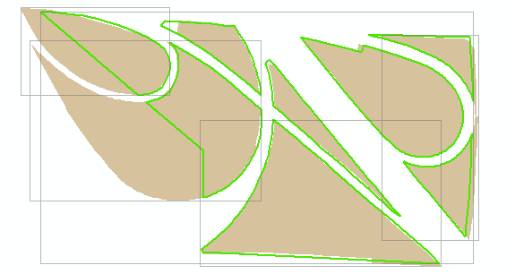
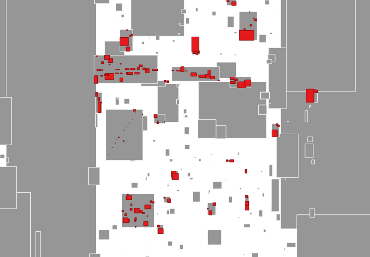
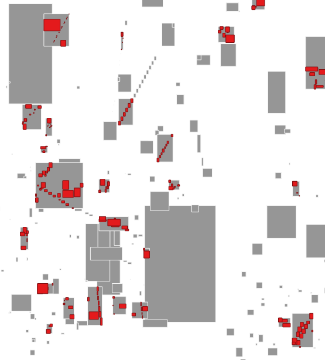

# Tilerefresh

## Description

Given 2 spatial datasets in Oracle (usually old and new), determine differences and return the minimum bounding rectangles 
of changes.  Feed the rectangles to Geowebcache to truncate or reseed tiles.

## Dependencies

* working sqlplus
* write access to an oracle spatial schema 
* python

## Full Setup: Compile and run all unit tests and create empty param tables

(Windows: replace `./gradlew` with `gradlew.bat`)

* `./gradlew runUnitTests createParamTables -Pdb={database} -Pschema={schema} -Ppw={password}`

    * Required 
        * `database` The database
        * `schema` The database schema 
        * `password` The schema password
        * These parameters can also be set in gradle.properties       

Example

* `./gradlew runUnitTests createParamTables -Pdb=GEOCDEV.DOITT.NYCNET -Pschema=MSCHELL -Ppw=iluvdoitt247`

## Refresh Setup: Re-compile and run all unit tests.  Parameter and output tables exist so don't overwrite them

(Windows: replace `./gradlew` with `gradlew.bat`)

* `./gradlew runUnitTests -Pdb={database} -Pschema={schema} -Ppw={password}`

    * Required 
        * `database` The database name 
        * `schema` The database schema 
        * `password` The schema password
        * These parameters can also be set in gradle.properties       

Example

* `./gradlew runUnitTests -Pdb=GEOCDEV.DOITT.NYCNET -Pschema=BASEMAP -Ppw=iluvdoitt247`

List other available tasks

* `./gradlew tasks --all`

## Set Up Params and Run MBR generator

See the /scripts directory for sample SQLs that perform all of the steps below in sequence.

TILEREFRESH_PARAMS Sample Values

PROJECTNAME | LAYER_NAME | TABLE1 | TABLE2 | SYNTHKEY | BUSINESSKEY | SRID | COLS
------------ | ------------- | ------------- | ------------- | ------------- | ------------- | ------------- | ------------- |
 | BASEMAP | CENTERLINE_SDO | CENTERLINE_SDO | CENTERLINE_SDO_OLD | objectid | physicalid | 3857 |  STNAME_LABEL,RW_TYPE,TRAFDIR,CARTO_DISPLAY_LEVEL  | `

Notes:

1. TABLE1 and TABLE2 order does not matter.  One is the new, the other old.
2. SYNTHKEY is any synthetic key used to uniquely ID records
3. BUSINESSKEY is a key to compare the same feature across versions. This is a big bad assumption
4. SRID is the spatial reference identifier of the tileset.  Changeset minimum bounding rectangles will be output in this srid regardless of the data srid.
5. COLS is a comma-delimited list of columns where a change would trigger new tiles.  If only shape changes matter repeat the business key here.

Run wrapper TILEREFRESH.DUMPCALLS

` CALL tilerefresh.DUMPCALLS('BASEMAP',
                            'CENTERLINE_SDO');`

Results output as 'x1,y1,x2,y2' tilerefresh_seeds.seedcall:

`SELECT seedcall from tilerefresh_seeds where project_name = 'BASEMAP' and layer_name = 'CENTERLINE_SDO';`

The column tilerefresh_seeds.shape is also ogleable in QGIS or ArcMap.

## Call GWC to refresh tiles

refreshtiles.py layername gwcuser gwcpassword gwcspatialreference zoomstart zoomstop imageformat operation boundingboxfile gwcendpoint

example:

` refreshtiles.py basemap admin iluvdoitt247 900913 16 21 jpeg truncate D:\matt_projects_data\mschell_data\tilerefresh\basemap\centerline_sdo.txt  "http://msslva-ctwgeo01.csc.nycnet:8080/geoserver/gwc/rest/seed/basemap.json" `

## Illustrations

In this first Picasso the brown fills represents old shapes for a parks layer, green outlines are the new shapes.  Grey boxes are minumum bounding rectangles generated by the tilerefresh project. All 8 parks change shape but only 3 smaller park rectangles toward the center are completely contained by others and dissolve out of existence.  

On visual inspection we humans see that this result is suboptimal and the remaining 5 minimum bounding rectangles could potentially dissolve into one new uber-rectangle. But in cases where the shapes are less compact the rectangles have a tendency to grow unbound until one minimum bounding rectangle covers the full extent of the layer.  

Initial noodling on better spatial clustering in PostGIS.  The script dissolved red MBRs, where shown, into grey MBRs.  Grey MBRs with no red overlaps were passed through untouched.  While a step in the right direction, in most cases the large shapes and MBRs are the driver of inefficiencies.  Further noodling (noted in sample.sql comments) TBD. 

`tilerefresh\scripts\dbscan_sample.sql`

